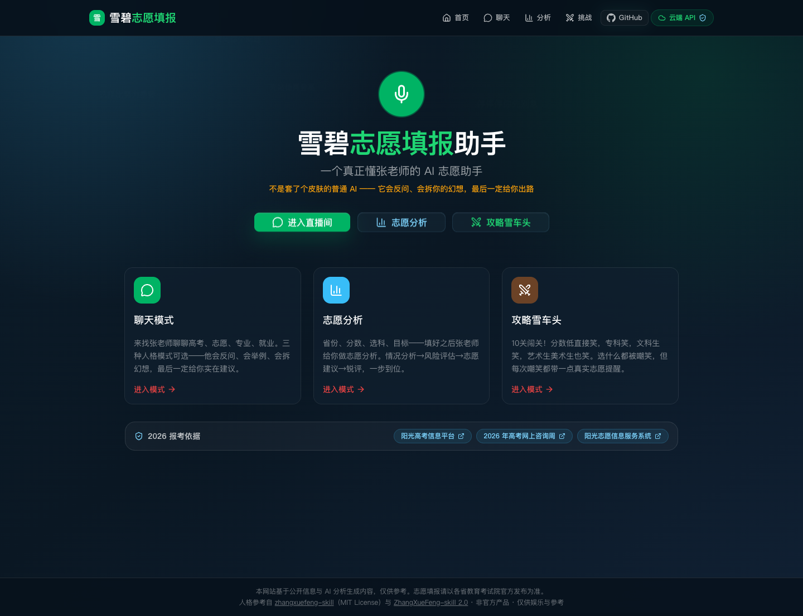
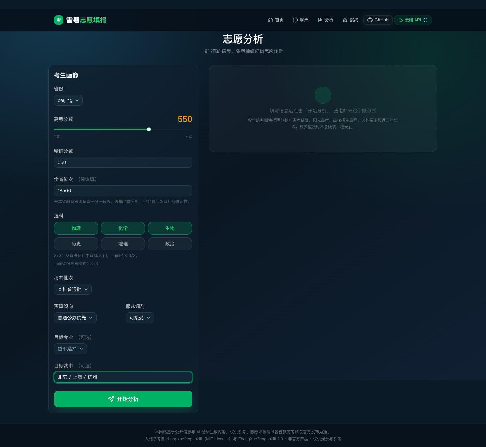
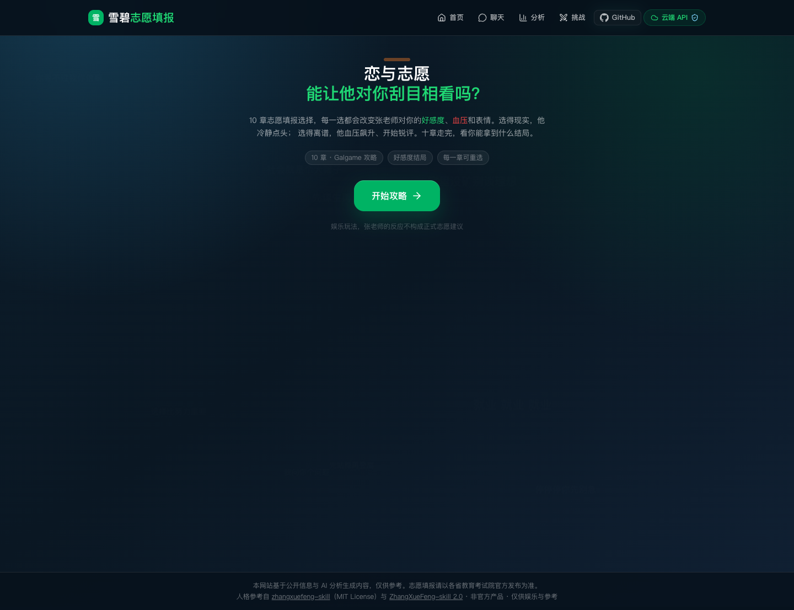

# 雪碧志愿填报助手

一个张老师风格的高考志愿互动工具：直播间聊天、AI 志愿分析、恋与志愿挑战模式三合一。

不是单纯套一层「毒舌人设」的聊天机器人。项目把张雪峰式表达、2026 报考信息核验、普通家庭试错成本、冲稳保风险和 API 云端隐藏结合起来，做成一个可以直接公开分享的网站。

## 在线访问

- 国内优先：[腾讯云 EdgeOne 访问](https://gaokao-volunteer-assistant.edgeone.dev/)
- 海外备用：[Vercel 访问](https://gaokao-volunteer-assistant-coral.vercel.app/)
- 代码仓库：[GitHub Repository](https://github.com/shiyuanyeming-hub/gaokao-volunteer-assistant)

如果只是想让别人使用网站，直接发 EdgeOne 链接即可。GitHub 仓库负责展示代码和项目说明，EdgeOne / Vercel 链接才是可直接打开使用的网站。

## 项目截图

### 首页



### 志愿分析



### 恋与志愿挑战模式



## 核心功能

### 直播间聊天

- 模拟直播间连麦式问答，围绕高考、志愿、专业、城市、就业做快速判断。
- 支持不同语气模式：直播间雪峰、出分夜雪峰、急眼雪峰。
- 不是只负责锐评：每次拆幻想后必须给出下一步动作。

### 志愿分析

- 输入省份、分数、位次、选科、批次、预算、服从调剂、目标专业/城市。
- 输出结构化诊断：情况分析、风险评估、志愿建议、张老师锐评。
- 强制提醒核对一分一段表、招生章程、选科要求、近三年位次、调剂规则、体检/语种/单科限制、转专业规则和学费。
- 缺少位次时不会硬装「稳录」，而是明确提示先查官方数据。

### 攻略雪车头

- Galgame 式 10 关挑战，主题是「挑战不被张老师嘲笑」。
- 分数低、专科、文科、艺术生、美术生、盲目冲名校、只看网红城市等选择都会触发不同锐评。
- 娱乐玩法背后保留现实提醒：每次嘲笑都对应一个志愿风险点。

### API 与公开分享

- 支持 DeepSeek、OpenAI、Qwen、Gemini 和自定义 OpenAI-compatible API。
- 可以把 API Key 配在部署平台环境变量里，用户访问网页时不需要自己填 Key。
- 浏览器端只请求本项目后端接口，真实 API Key 不会出现在前端代码里。
- 当服务端 API 配好后，页面会显示「云端 API」状态。

## 产品设计思路

这个项目面向三类人：

- 高考生：想快速知道自己的分数、选科和志愿风险在哪里。
- 家长：想听直白、现实、不绕弯子的解释。
- 项目展示/作品集浏览者：希望一眼看懂这个项目不只是 AI 聊天壳，而是有数据边界、产品路径和部署能力。

核心原则：

- 选择比努力重要，但选择必须回到真实数据。
- 锐评不是目的，给出路才是目的。
- 对普通家庭来说，滑档、退档、不可接受调剂和高学费试错都是硬风险。
- 官方来源优先于短视频、营销号和评论区经验。

## 技术栈

- Framework：Next.js 16 + React 19
- Language：TypeScript
- UI：Tailwind CSS、shadcn 风格组件、lucide-react、framer-motion
- AI：AI SDK + OpenAI-compatible providers
- Deployment：腾讯云 EdgeOne + Vercel
- Repo：GitHub

## 本地运行

```bash
npm install
npm run dev
```

打开终端显示的本地地址，通常是：

```text
http://localhost:3000
```

如果端口被占用，Next.js 会自动切到 `3001`、`3002` 等端口。

## API 配置

### 本地调试

复制 `.env.example` 为 `.env`，然后填入服务端 Key：

```env
LLM_PROVIDER=deepseek
DEEPSEEK_API_KEY=your-server-side-key
DEEPSEEK_MODEL=deepseek-chat
DEEPSEEK_BASE_URL=https://api.deepseek.com/v1
ALLOW_CLIENT_API_OVERRIDE=false
PUBLIC_REQUESTS_PER_HOUR=60
```

也支持：

```env
OPENAI_API_KEY=
OPENAI_MODEL=gpt-4o-mini

QWEN_API_KEY=
QWEN_MODEL=qwen-plus
QWEN_BASE_URL=https://dashscope.aliyuncs.com/compatible-mode/v1

GEMINI_API_KEY=
GEMINI_MODEL=gemini-2.0-flash
```

### 公开部署

如果要把网站发给别人直接用，不要让用户自己填 Key，也不要把 Key 写进代码或提交到 GitHub。正确做法是：

1. 在 EdgeOne / Vercel 的 Environment Variables / Secrets 里配置服务端 API Key。
2. 前端只请求本项目的 `/api/chat`、`/api/analysis`、`/api/recommend` 等后端接口。
3. 后端读取环境变量调用 DeepSeek / OpenAI / Qwen / Gemini。
4. 浏览器永远拿不到真实 API Key。

变量名必须完整填写。不要只建一个叫 `deepseek`、`qwen` 或 `api_key` 的变量，代码不会读取这些名字。

### API 排查

- DeepSeek：默认模型 `deepseek-chat`，Base URL 使用 `https://api.deepseek.com/v1`。
- Qwen：默认模型 `qwen-plus`，Base URL 通常使用 `https://dashscope.aliyuncs.com/compatible-mode/v1`；如果使用百炼专属实例，需要填专属兼容地址。
- Qwen 的 Key 必须是 DashScope / 阿里云百炼「模型服务」API Key，不是阿里云 RAM 的 AccessKey ID / Secret。
- 页面右上角 `API` 的「测试连接」会同时测试普通请求和流式聊天。
- 如果复制了 `Bearer sk-...` 或完整接口地址 `/chat/completions`，应用会自动清理成可用格式。

## 部署说明

### 腾讯云 EdgeOne

项目已部署在腾讯云 EdgeOne：

```text
https://gaokao-volunteer-assistant.edgeone.dev/
```

推荐设置：

- Production Branch：`main`
- Build Command：`npm run build`
- Output / Framework：Next.js
- Environment Variables：填写 `LLM_PROVIDER`、对应服务商 API Key、模型名和 Base URL

只要 EdgeOne 绑定了 GitHub 仓库，推送到 `main` 后会自动重新构建和发布。

### Vercel 备用

```text
https://gaokao-volunteer-assistant-coral.vercel.app/
```

如果 Vercel 修改了 Environment Variables，需要重新部署一次 Production，线上网站才会读到新 Key。

## 信息来源与边界

人格和表达层参考：

- [alchaincyf/zhangxuefeng-skill](https://github.com/alchaincyf/zhangxuefeng-skill)（MIT License）
- [a18515373115-droid/ZhangXueFeng-skill](https://github.com/a18515373115-droid/ZhangXueFeng-skill)：2.0 版现实咨询协议、官方数据边界、情绪安全边界和普通家庭策略参考。

2026 报考信息依据层参考：

- [阳光高考信息平台](https://gaokao.chsi.com.cn/)
- [2026 年高考网上咨询周](https://gaokao.chsi.com.cn/zxdy/)：6 月 22 日至 28 日开放文字问答和视频直播咨询。
- [阳光志愿信息服务系统](https://gaokao.chsi.com.cn/zyck/)：2026 年支持 31 省本专科普通批次志愿筛选。
- [教育部官网](https://www.moe.gov.cn/)
- [各省招生政策入口](https://gaokao.chsi.com.cn/gkxx/zc/ss/)

本项目是娱乐化和辅助型工具，不冒充张雪峰本人，不承诺录取，不替代官方志愿填报系统。所有结果必须以各省教育考试院、阳光高考平台和目标高校招生章程为准。

## 下一步计划

- 增加更完整的省份选科模式和专业组规则校验。
- 增加志愿报告导出 PDF。
- 增加每日政策/专业变化订阅。
- 增加更细的家庭预算、城市生活成本和读研周期模型。
- 增加公开访问的轻量限流与使用统计面板。
